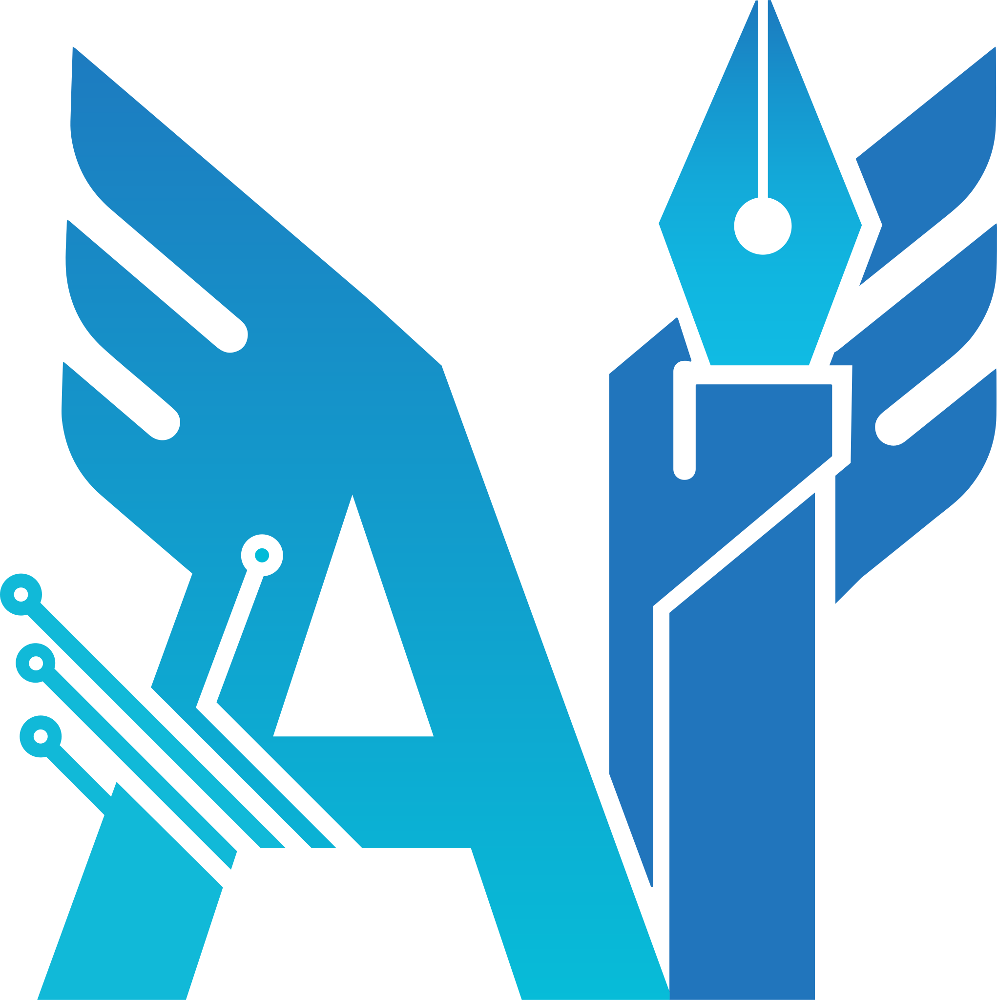

  

<h1 style="color:#003366; font-family:Calibri;">AI Student Scientific Association of Yadegar-e-Imam University</h1>

Welcome to the official GitHub page of the <b>AI Student Scientific Association</b> at <b>Yadegar-e-Imam University</b>. 
Our association serves as an academic and research-oriented community that fosters innovation, education, and collaboration in the rapidly evolving field of <b>Artificial Intelligence</b>.

---

<h2 style="color:#003366; font-family:Calibri;">🎓 About Us</h2>

The <b>AI Student Scientific Association</b> is a student-led academic body under the supervision of the Faculty of Computer Engineering at Yadegar-e-Imam University.  
Our primary objective is to advance AI education and research among students by creating a platform that bridges <b>theoretical foundations</b> and <b>practical implementations</b>.

<ul style="color:white; font-family:Cambria;">
<li>Scientific research and experimentation</li>
<li>Knowledge sharing and academic collaboration</li>
<li>Development of real-world AI applications</li>
</ul>

---

<h2 style="color:#003366; font-family:Calibri;">🔬 Core Activities</h2>

<ul style="color:white; font-family:Cambria;">
<li><b>Specialized Courses and Lectures:</b> Providing structured training programs in machine learning, deep learning, and data-driven technologies.</li>
<li><b>Workshops and Technical Labs:</b> Offering hands-on experience in developing and deploying AI-based systems.</li>
<li><b>Seminars and Webinars:</b> Hosting academic talks and discussions featuring experts, researchers, and industry professionals.</li>
<li><b>Research Collaborations:</b> Encouraging student participation in scientific projects and publications related to AI and data science.</li>
</ul>

---

<h2 style="color:#003366; font-family:Calibri;">📚 Research & Educational Projects</h2>

Our repositories include educational resources, research codebases, and collaborative projects in:

<ul style="color:white; font-family:Cambria;">
<li>Machine Learning</li>
<li>Deep Learning</li>
<li>Computer Vision</li>
<li>Natural Language Processing</li>
<li>Data Mining and Predictive Analytics</li>
</ul>

<blockquote style="color:#cccccc; font-family:Cambria;">All content is open-access to promote transparency, collaboration, and academic contribution.</blockquote>

---

<h2 style="color:#003366; font-family:Calibri;">📅 Academic Engagement</h2>

<ul style="color:white; font-family:Cambria;">
<li>Academic seminars, conferences, and AI competitions</li>
<li>Collaborative projects with university departments and research groups</li>
<li>Workshops and training series aligned with emerging AI trends</li>
<li>Student mentoring programs for AI research and innovation</li>
</ul>

---

<h2 style="color:#003366; font-family:Calibri;">📫 Contact & Collaboration</h2>

📧 <b>Email:</b> <a href="mailto:yadegar.ai.ssa@gmail.com" style="color:#4da6ff;">yadegar.ai.ssa@gmail.com</a> 
🌐 <b>Website:</b> <a href="https://yi.iau.ir/en" style="color:#4da6ff;">Yadegar-e-Imam University</a> 
📢 <b>Telegram Channel:</b> <a href="https://t.me/yadegar_ai" style="color:#4da6ff;">t.me/Yadegar_AI</a>

---

  <h3 style="color:#003366; font-family:Calibri; display: flex; align-items: center; justify-content: center; gap: 10px;">
    
    “Promoting knowledge, fostering innovation, and advancing Artificial Intelligence through academia.”
  </h3>

  

    <i>AI Student Scientific Association — Yadegar-e-Imam University, Tehran, Iran</i>
  

